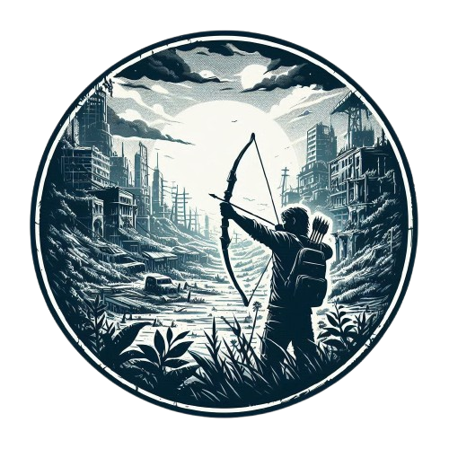
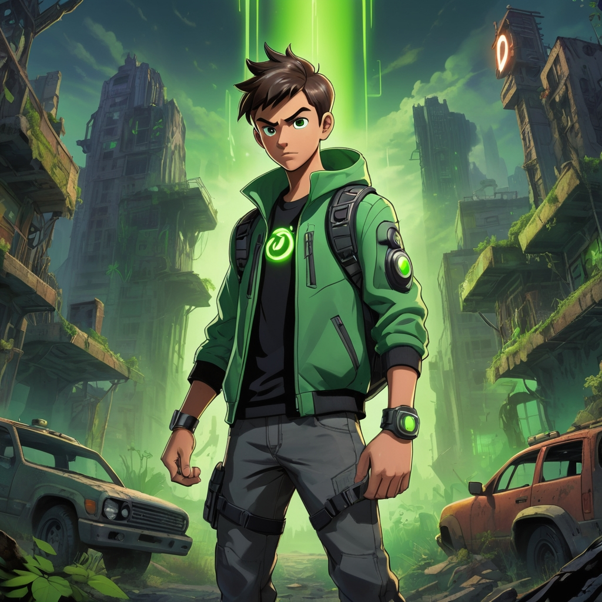
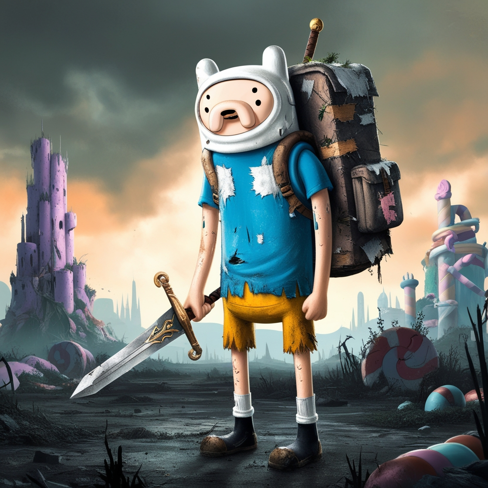
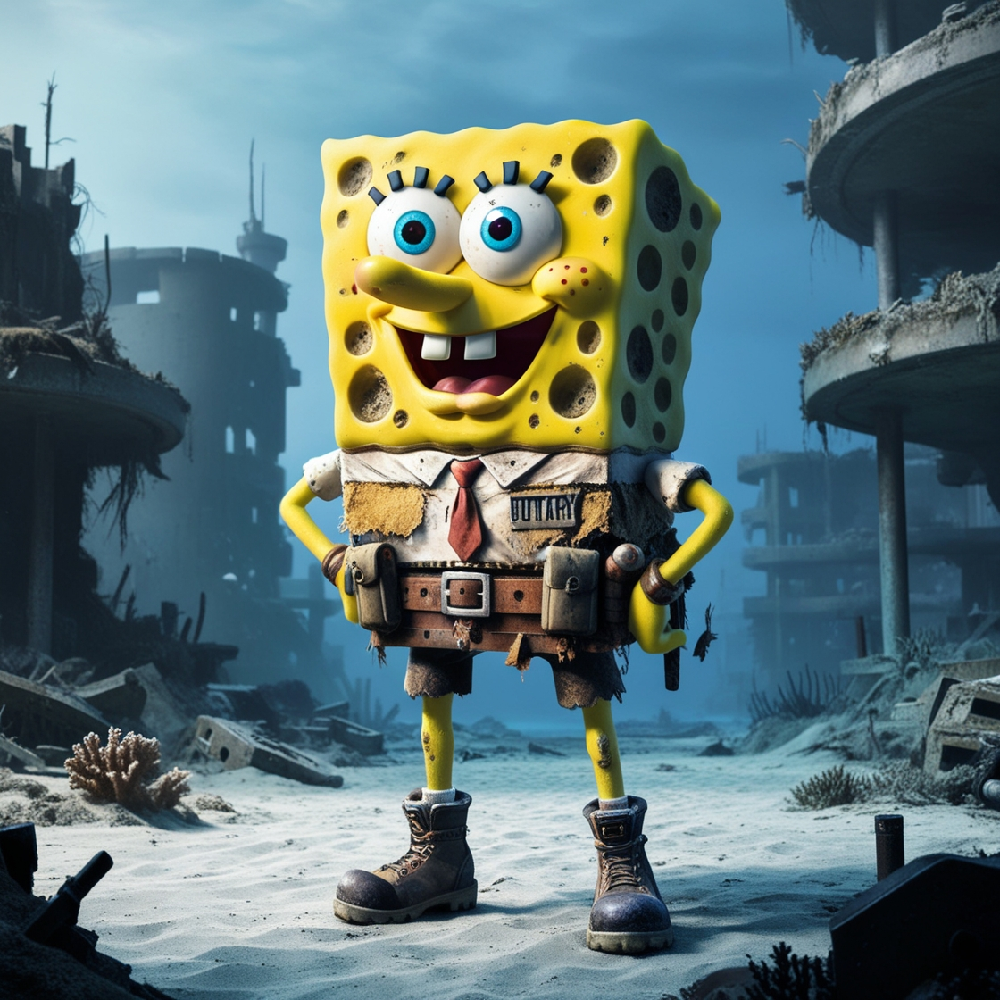
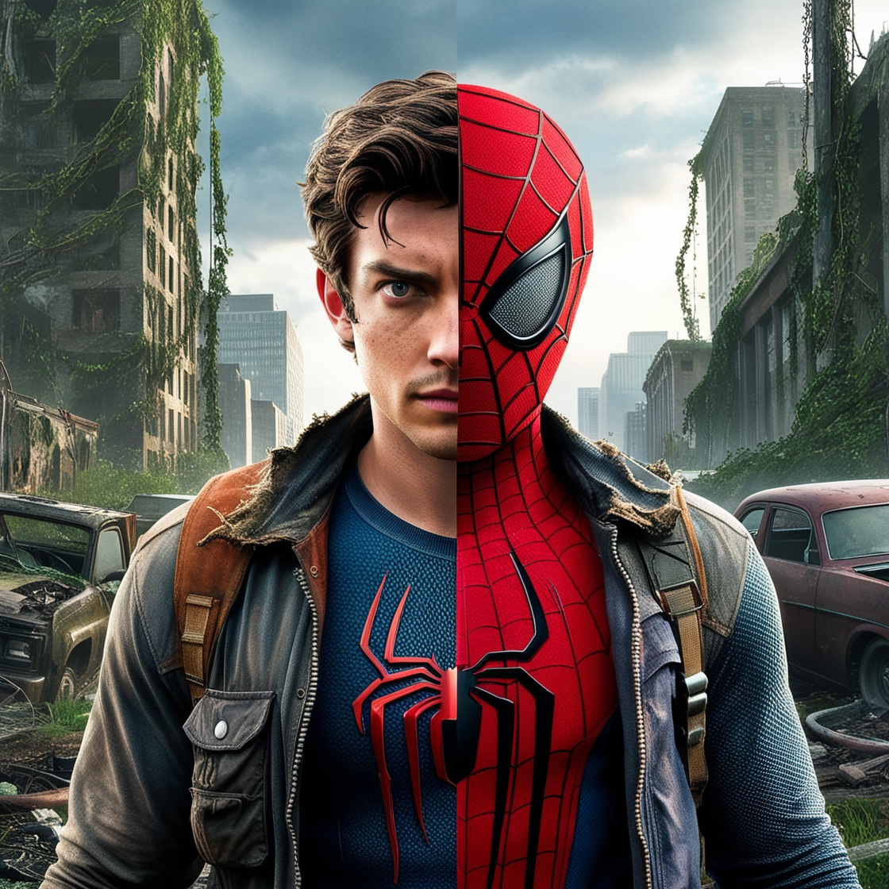
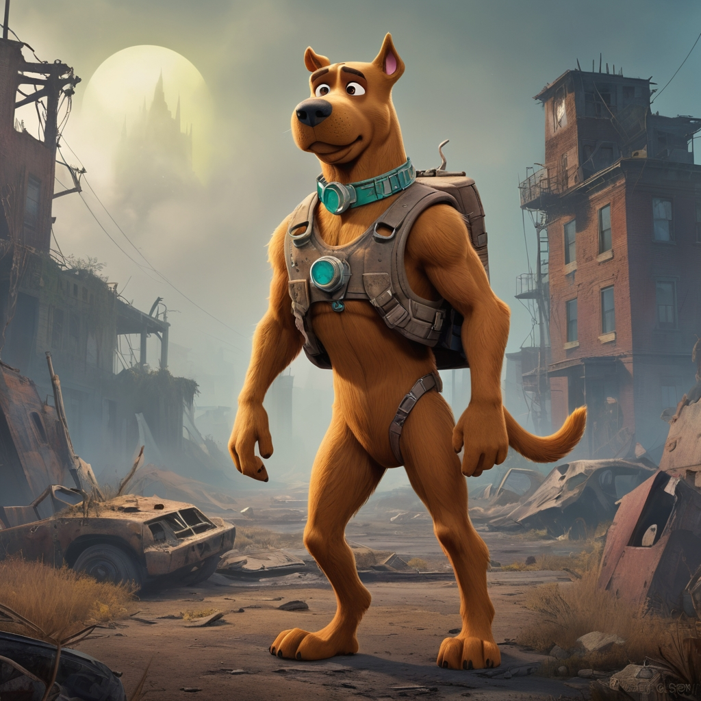
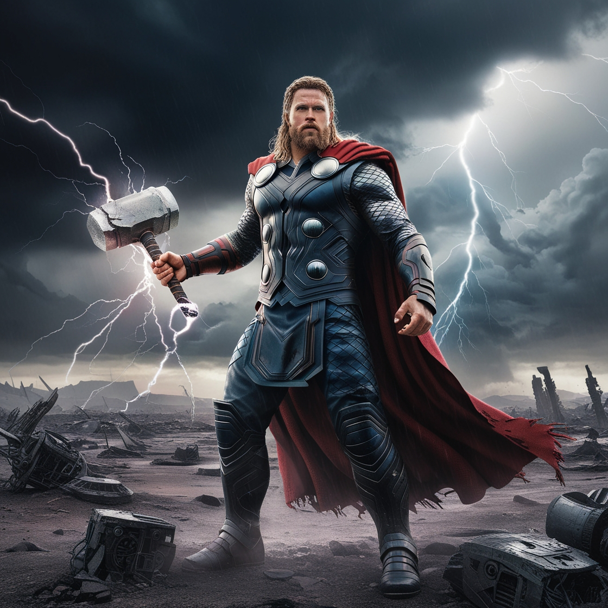

# The World Of The Last Of Us - Portfolio

Este projeto é uma aplicação web interativa que apresenta um portfólio inspirado no universo de *The Last Of Us*. Ele mistura elementos de design visual envolvente com personagens fictícios e narrativas criativas.

## Tecnologias Utilizadas

- **HTML5**: Para a estruturação do conteúdo.
- **CSS3**: Incluindo o uso de `animate.css` para animações visuais.
- **JavaScript** (futuro ou potencial): Base para tornar a página mais interativa.
- **Imagens Customizadas**: Um conjunto variado de personagens e ícones.

## Funcionalidades

- **Barra de Pesquisa**: Possibilidade de pesquisar dentro do portfólio, em uma aprimoração furura.
- **Cards Interativos**: Apresentação de personagens com detalhes como:
  - Nome do personagem.
  - Descrição curta.
  - Status (e.g., *Healthy*, *Injured*).
  - Localização (e.g., *Quarantine Zone*, *Dense Forest*).
  - Criadores dos personagens.
  
## Capturas de Tela

### Página Inicial


### Exemplos de Cards
#### Batman


#### Ben 10


#### Finn


#### Bob Esponja


#### Homem Aranha


#### Harry Potter


#### Ícone de localização


#### Ícone de status


#### Mulher Maravilha


#### Perfil


#### Scooby-Doo


#### Thor


## Como Executar e links usados

https://www.frontendmentor.io/challenges/nft-preview-card-component-SbdUL_w0U

https://app.leonardo.ai/

https://www.bing.com/ck/a?!&&p=a6dad9d6fbdd6de3249b1bbe0d03aa63115ac1abbb6bfc6d4be4d30e0a1815b6JmltdHM9MTczMjA2MDgwMA&ptn=3&ver=2&hsh=4&fclid=0298a2e2-c87f-6489-1f78-b3abcc7f623a&psq=ui+universe&u=a1aHR0cHM6Ly91aXZlcnNlLmlvLw&ntb=1

1. Clone este repositório:
   ```bash
   git clone https://github.com/mariafer057/portifolio-gerencia.git

ou no navegador colocar este link: https://mariafer057.github.io/portifolio-gerencia/
